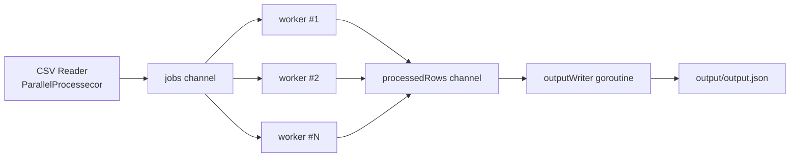

## Problem Statement

Build and maintain a small Go CLI tool that reads a CSV file of domains and converts it into a JSON array written to `./output/output.json`.

## Current Code Understanding

- Entry point: `main.go` calls `ProcessFile("./data/top-100.csv")`.
- `ProcessFile` delegates to `ParallelProcessecor(path)` and returns `true/false` based on error.
- `ParallelProcessecor`:
  - Opens the input CSV file.
  - Creates/truncates `./output/output.json`.
  - Reads CSV records in a loop.
  - Sends each record into a `jobs` channel.
  - Starts a worker pool (`WORKER_POOL = 50`) to transform records concurrently.
  - Collects transformed rows on `processedRows`.
  - Runs one writer goroutine that drains `processedRows` and writes a valid JSON array.
- `worker` converts each CSV row using `CSVToJSON`.
- `CSVToJSON` maps:
  - `record[0]` -> `domainName`
  - `record[1]` -> `popularity` (parsed as integer, stored as `int16`)
- Output object shape:
  - `{ "domainName": "<domain>", "popularity": <number> }`

## Fan-Out / Fan-In Processing Diagram

